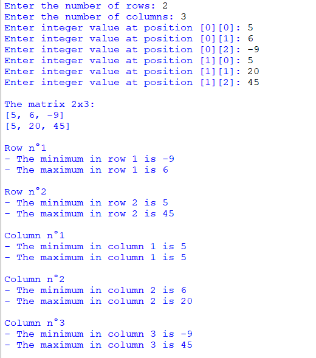

## Description
This program allows users to input the dimensions of a matrix and its elements. It then identifies and displays the minimum and maximum values for each row and column within the matrix.
## Example

